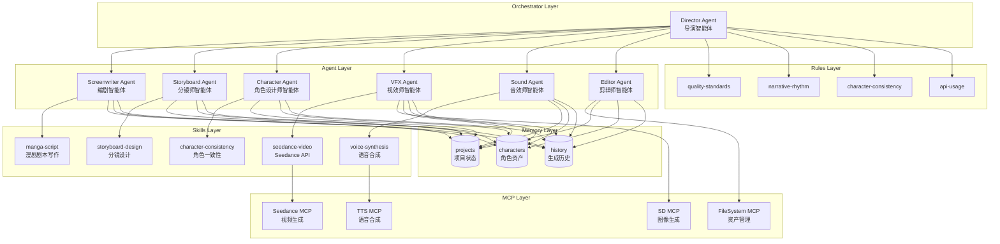
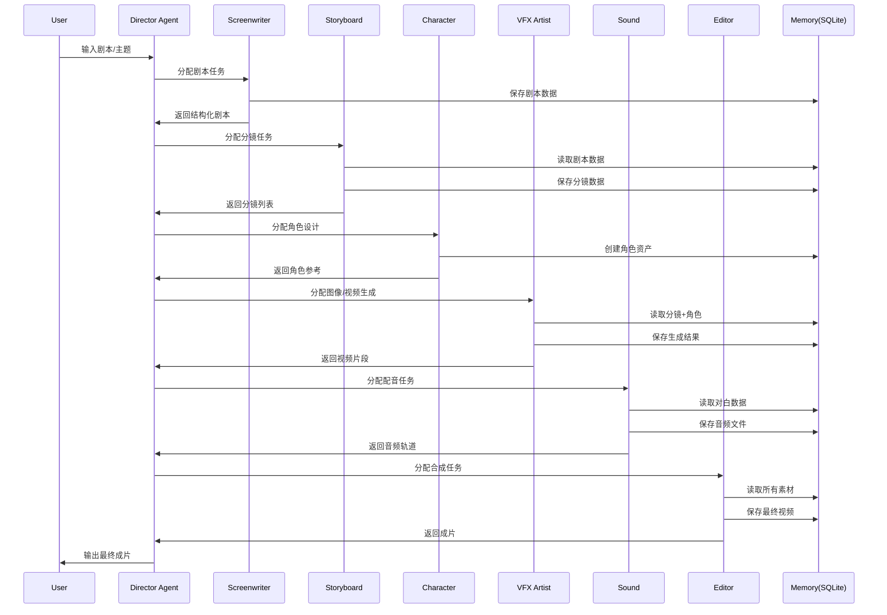

## 产品概述

构建一个基于 CodeBuddy 生态的 AI 漫剧生产流水线系统，采用 Agent 驱动架构实现从剧本创作到成片输出的全链路自动化生成。

## 核心特性

- **子 Agent 体系**：模拟专业影视制作团队（导演、编剧、分镜师、摄影师、视效师、音效师、剪辑师），各司其职、协同工作
- **Skills 知识库**：封装漫剧制作领域专业知识和最佳实践，包括剧本写作规范、分镜设计、角色一致性技术、Seedance API 调用等
- **MCP 工具集成**：统一接入 Seedance 视频生成、TTS 语音合成、SD 图像生成等外部 API
- **Memory 持久化**：项目状态追踪、角色资产库、生成历史记录、用户偏好学习
- **Rules 质量约束**：画面质量标准、叙事节奏约束、角色一致性检查、API 调用规范

## 流水线阶段

1. 剧本输入/创作
2. 分镜拆解与镜头设计
3. 角色设计与资产管理
4. 文生图（分镜图像生成）
5. 图生视频（Seedance 动态化）
6. 配音与音效
7. 最终合成输出

## 技术栈

- **Agent 框架**：CodeBuddy 子智能体体系（.codebuddy/agents/*.md）
- **Skills 框架**：CodeBuddy Skills（SKILL.md 定义格式）
- **Rules 框架**：CodeBuddy Project Rules（.codebuddy/rules/*.md）
- **MCP 协议**：Model Context Protocol 外部工具集成
- **数据持久化**：SQLite（现有 data.db）
- **图生视频 API**：Seedance 2.0（火山引擎）
- **图像生成**：Stable Diffusion API / DALL-E API
- **TTS API**：火山引擎语音合成 / Azure TTS

## 技术架构

### 系统架构图



### 数据流架构



## 实现方案

### 核心设计决策

1. **Agent 角色设计**：参考 MovieAgent 论文的多角色协同模式，模拟专业影视制作团队分工
2. **Skills 封装**：将领域知识（剧本写作、分镜设计、角色一致性）封装为可复用的 Skill，遵循 CodeBuddy SKILL.md 格式
3. **MCP 集成**：使用 MCP 协议统一接入外部 API（Seedance、TTS、SD），便于切换和扩展
4. **Memory 设计**：使用 SQLite 存储项目状态、角色资产、生成历史，支持断点续跑
5. **Rules 约束**：定义质量标准和风格约束，确保输出一致性

### 实现要点

- **Agent 定义格式**：遵循现有 `~/.codebuddy/agents/*.md` 格式，包含 name、description、tools、model 等元信息
- **Skill 定义格式**：遵循 `SKILL.md` 格式，包含 name、description、metadata 等头部信息和详细使用说明
- **MCP 配置格式**：遵循 `~/.codebuddy/mcp.json` 格式，配置 command、args、env
- **数据库表设计**：projects（项目）、scripts（剧本）、storyboards（分镜）、characters（角色）、assets（资产）

## 目录结构

```
my-ai-video-agent/
├── .codebuddy/
│   ├── agents/                         # [NEW] 子 Agent 定义
│   │   ├── director.md                 # 导演 Agent - 整体规划、质量把控、协调各 Agent
│   │   ├── screenwriter.md             # 编剧 Agent - 剧本创作、对白设计、情节结构
│   │   ├── storyboard-artist.md        # 分镜师 Agent - 场景拆解、镜头设计、Prompt 生成
│   │   ├── character-designer.md       # 角色设计师 Agent - 角色一致性、风格统一、资产管理
│   │   ├── vfx-artist.md               # 视效师 Agent - 图像生成、视频生成（Seedance）
│   │   ├── sound-designer.md           # 音效师 Agent - TTS 配音、音效、BGM
│   │   └── editor.md                   # 剪辑师 Agent - 转场、字幕、节奏控制、最终合成
│   │
│   ├── rules/                          # [NEW] 规则定义
│   │   ├── quality-standards.md        # 画面质量标准 - 分辨率、一致性、清晰度要求
│   │   ├── narrative-rhythm.md         # 叙事节奏约束 - 镜头时长、转场、情绪曲线
│   │   ├── character-consistency.md    # 角色一致性检查 - 外观、服装、表情一致性规则
│   │   └── api-usage.md                # API 调用规范 - 成本控制、重试策略、错误处理
│   │
│   └── mcp.json                        # [NEW] MCP 服务配置 - Seedance、TTS、SD API 接入
│
├── skills/                             # [NEW] 本地 Skills
│   ├── manga-script/                   # 漫剧剧本写作 Skill
│   │   └── SKILL.md                    # 剧本结构、三幕式、对白设计、情节节奏
│   ├── storyboard-design/              # 分镜设计 Skill
│   │   └── SKILL.md                    # 镜头语言、构图法则、运镜设计、Prompt 模板
│   ├── character-consistency/          # 角色一致性 Skill
│   │   └── SKILL.md                    # IP-Adapter、LoRA、Reference 技术方案
│   ├── seedance-video/                 # Seedance 视频生成 Skill
│   │   └── SKILL.md                    # API 调用、Prompt 优化、参数配置
│   └── voice-synthesis/                # 语音合成 Skill
│       └── SKILL.md                    # TTS 选型、情感控制、语速调节
│
├── schemas/                            # [NEW] 数据模型定义
│   ├── project.schema.json             # 项目数据结构
│   ├── script.schema.json              # 剧本数据结构（场景、对白、动作）
│   ├── storyboard.schema.json          # 分镜数据结构（镜头、描述、Prompt）
│   └── character.schema.json           # 角色数据结构（外观、参考图、关键词）
│
├── templates/                          # [NEW] 数据模板
│   ├── script-template.json            # 剧本模板
│   ├── storyboard-template.json        # 分镜模板
│   └── character-template.json         # 角色模板
│
├── assets/                             # [NEW] 项目资产目录
│   ├── characters/                     # 角色参考图/LoRA
│   ├── scenes/                         # 场景素材
│   ├── audio/                          # 音频素材
│   └── outputs/                        # 生成输出
│
├── docs/                               # [NEW] 文档
│   ├── ARCHITECTURE.md                 # 系统架构文档
│   ├── WORKFLOW.md                     # 使用流程说明
│   └── API-REFERENCE.md                # API 参考文档
│
└── data.db                             # [MODIFY] SQLite 数据库 - 新增表结构
```

## 关键代码结构

### Agent 定义格式

```
---
name: director
description: AI 漫剧制作导演，负责整体规划、任务分配、质量把控。自动协调编剧、分镜师、角色设计师、视效师、音效师、剪辑师完成漫剧制作。
tools: Read, Grep, Glob, Task
model: opus
---
```

### MCP 配置格式

```
{
  "mcpServers": {
    "seedance": {
      "command": "npx",
      "args": ["seedance-mcp-server"],
      "env": {
        "VOLC_ACCESS_KEY": "${VOLC_ACCESS_KEY}",
        "VOLC_SECRET_KEY": "${VOLC_SECRET_KEY}"
      }
    }
  }
}
```

### 数据库表结构

```sql
-- 项目表
CREATE TABLE projects (
    id TEXT PRIMARY KEY,
    name TEXT NOT NULL,
    status TEXT DEFAULT 'draft',
    created_at DATETIME DEFAULT CURRENT_TIMESTAMP,
    updated_at DATETIME DEFAULT CURRENT_TIMESTAMP
);

-- 角色表
CREATE TABLE characters (
    id TEXT PRIMARY KEY,
    project_id TEXT REFERENCES projects(id),
    name TEXT NOT NULL,
    description TEXT,
    reference_image TEXT,
    style_keywords TEXT,
    created_at DATETIME DEFAULT CURRENT_TIMESTAMP
);
```

## Agent Extensions

### Skill

- **skill-creator**
- 用途：创建核心 Skills（manga-script、storyboard-design、character-consistency、seedance-video、voice-synthesis）
- 预期结果：生成符合 CodeBuddy 规范的 SKILL.md 文件，封装漫剧制作领域知识