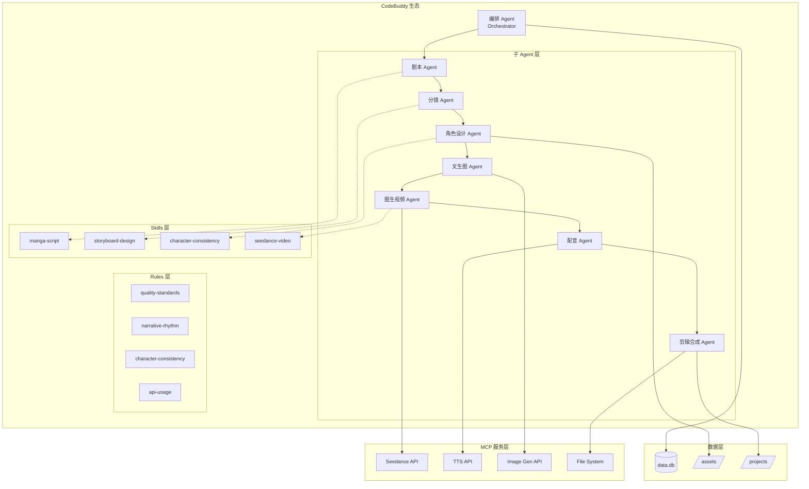
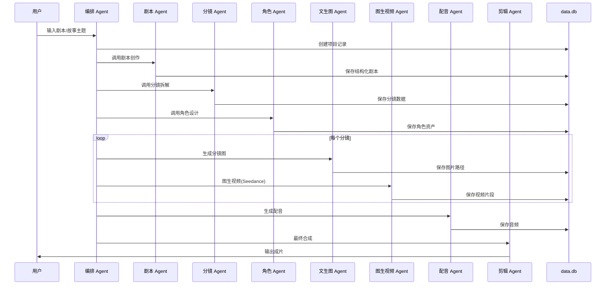

## 产品概述

构建一个基于 CodeBuddy 生态的 AI 漫剧生产流水线，采用 Agent 驱动架构，通过子 Agent 协作完成从剧本创作到视频合成的全流程自动化生产。

## 核心特点

- 不做传统应用，而是用 Agent 驱动流水线
- 完整利用 CodeBuddy 生态：子 Agent + Skills + MCP + Memory + Rules
- 图生视频核心使用 Seedance（字节跳动/火山引擎 API）

## 核心功能

### 流水线子 Agent

1. **编排 Agent (Orchestrator)** - 协调各子 Agent、状态管理、断点续跑、质量把控
2. **剧本 Agent** - 剧本创作、改编、结构化输出
3. **分镜 Agent** - 场景拆解、镜头设计、Prompt 生成
4. **角色设计 Agent** - 角色一致性、风格统一、资产管理
5. **文生图 Agent** - 调用 SD/MJ/DALL-E 生成分镜图
6. **图生视频 Agent** - 调用 Seedance 生成动态视频
7. **配音 Agent** - TTS 生成、情感控制
8. **剪辑合成 Agent** - 转场、字幕、BGM、最终输出

### 配套能力

- Skills：封装漫剧制作领域知识和最佳实践
- MCP：统一外部 API 集成（Seedance、TTS、图像生成）
- Rules：质量标准、风格约束、API 调用规范
- Memory：项目状态持久化、角色资产库、风格偏好

## 技术栈

- **Agent 框架**: CodeBuddy 子智能体体系
- **Skills 框架**: CodeBuddy Skills（SKILL.md 定义）
- **Rules 框架**: CodeBuddy Project Rules（.codebuddy/rules/）
- **MCP 协议**: Model Context Protocol 外部工具集成
- **数据持久化**: SQLite（现有 data.db）
- **图生视频 API**: Seedance 2.0（火山引擎）
- **TTS API**: 火山引擎语音合成 / Azure TTS
- **图像生成**: Stable Diffusion API / DALL-E API

## 技术架构

### 系统架构图



### 数据流设计



## 实现方案

### 核心设计思路

采用 CodeBuddy 子智能体作为各阶段专家，通过编排 Agent 协调调度，Skills 封装领域知识，Rules 保障质量标准，Memory 实现状态持久化。

### 子 Agent 实现方式

CodeBuddy 子智能体通过 IDE 界面创建，配置：

- 名称和描述（用于自动路由匹配）
- 系统提示词（角色定义和任务说明）
- 可用工具和 MCP
- 关联知识库
- 勾选"子智能体"启用自动调用

### Skills 文件结构

每个 Skill 目录包含 SKILL.md 定义文件：

```
---
name: skill-name
description: |
  技能描述，说明何时使用此技能
---
# Skill 名称
详细的指令、流程、最佳实践...
```

### Rules 文件结构

放在 `.codebuddy/rules/` 目录下：

```
---
type: always  # 或 manual
---
# Rule 标题
规则内容...
```

### 数据模型设计

项目状态表（projects）:

- id, name, status, current_stage, created_at, updated_at

剧本表（scripts）:

- id, project_id, content, structure_json, created_at

分镜表（storyboards）:

- id, project_id, scene_index, description, prompt, image_path, video_path

角色表（characters）:

- id, project_id, name, description, reference_image, lora_path, style_keywords

## 实现注意事项

### 性能考虑

- Seedance API 为异步模式，需实现轮询等待机制
- 图片/视频生成耗时较长，支持断点续跑
- 使用 SQLite 事务保证数据一致性

### 错误处理

- 各阶段失败后记录状态，支持从失败点重试
- API 调用失败实现指数退避重试
- 关键步骤添加质量检查点

### 成本控制

- Seedance API 按时长计费（约 3.67 元/5秒@1080P）
- 记录每个阶段 API 调用消耗
- 支持预算限制和成本预警

## 目录结构

```
my-ai-video-agent/
├── .codebuddy/
│   ├── rules/                           # [NEW] Rules 定义目录
│   │   ├── quality-standards.md         # [NEW] 画面质量标准规则，定义分辨率、一致性、画面崩坏检测等质量标准
│   │   ├── narrative-rhythm.md          # [NEW] 叙事节奏约束规则，定义分镜时长、节奏控制、转场规范
│   │   ├── character-consistency.md     # [NEW] 角色一致性检查规则，定义角色外观、服装、表情一致性检查标准
│   │   └── api-usage.md                 # [NEW] API 调用规范规则，定义 Seedance/TTS 等 API 的调用限制和最佳实践
│   │
│   ├── skills/                          # [NEW] Skills 定义目录
│   │   ├── manga-script/                # [NEW] 漫剧剧本写作 Skill
│   │   │   └── SKILL.md                 # [NEW] 剧本写作规范、三幕结构、对白技巧等领域知识
│   │   ├── storyboard-design/           # [NEW] 分镜设计 Skill
│   │   │   └── SKILL.md                 # [NEW] 分镜拆解方法、镜头语言、运镜设计最佳实践
│   │   ├── character-consistency/       # [NEW] 角色一致性 Skill
│   │   │   └── SKILL.md                 # [NEW] LoRA训练、IP-Adapter、参考图技术方案
│   │   └── seedance-video/              # [NEW] Seedance 视频生成 Skill
│   │       └── SKILL.md                 # [NEW] Seedance API 使用指南、Prompt 技巧、参数优化
│   │
│   └── mcp.json                         # [NEW] MCP 服务配置文件，配置 Seedance、TTS、图像生成等外部服务
│
├── docs/                                # [NEW] 文档目录
│   ├── agent-definitions/               # [NEW] 子 Agent 定义文档
│   │   ├── orchestrator.md              # [NEW] 编排 Agent 定义：协调调度、状态管理、质量把控职责
│   │   ├── script-writer.md             # [NEW] 剧本 Agent 定义：剧本创作、结构化输出职责
│   │   ├── storyboard-designer.md       # [NEW] 分镜 Agent 定义：场景拆解、Prompt 生成职责
│   │   ├── character-manager.md         # [NEW] 角色设计 Agent 定义：角色一致性、资产管理职责
│   │   ├── image-generator.md           # [NEW] 文生图 Agent 定义：调用图像生成 API 职责
│   │   ├── video-generator.md           # [NEW] 图生视频 Agent 定义：调用 Seedance API 职责
│   │   ├── voice-synthesizer.md         # [NEW] 配音 Agent 定义：TTS 生成、情感控制职责
│   │   └── video-composer.md            # [NEW] 剪辑合成 Agent 定义：转场、字幕、最终输出职责
│   │
│   └── architecture.md                  # [NEW] 系统架构文档，整体设计说明和使用指南
│
├── schemas/                             # [NEW] 数据模式定义
│   └── database.sql                     # [NEW] SQLite 数据库表结构定义
│
├── templates/                           # [NEW] 模板文件
│   ├── script-template.json             # [NEW] 剧本输出 JSON 模板
│   ├── storyboard-template.json         # [NEW] 分镜输出 JSON 模板
│   └── character-template.json          # [NEW] 角色定义 JSON 模板
│
├── assets/                              # [NEW] 项目资产目录
│   ├── characters/                      # [NEW] 角色参考图/LoRA 存放目录
│   ├── scenes/                          # [NEW] 场景素材存放目录
│   └── outputs/                         # [NEW] 生成输出存放目录
│
├── projects/                            # [NEW] 漫剧项目目录（运行时生成）
│
├── data.db                              # [MODIFY] 现有数据库，添加项目管理相关表
├── data.db-shm                          # 现有文件
└── data.db-wal                          # 现有文件
```

## 关键接口定义

### 项目数据结构

```typescript
interface Project {
  id: string;
  name: string;
  status: 'draft' | 'processing' | 'completed' | 'failed';
  currentStage: 'script' | 'storyboard' | 'character' | 'image' | 'video' | 'voice' | 'compose';
  config: {
    style: string;           // 画风：anime/realistic/cartoon
    aspectRatio: string;     // 画面比例：16:9/9:16/1:1
    duration: number;        // 目标时长（秒）
    language: string;        // 语言：zh-CN/en-US
  };
  createdAt: string;
  updatedAt: string;
}

interface Storyboard {
  id: string;
  projectId: string;
  sceneIndex: number;
  description: string;      // 场景描述
  dialogue: string;         // 对白内容
  imagePrompt: string;      // 文生图 Prompt
  videoPrompt: string;      // 图生视频 Prompt
  cameraMovement: string;   // 运镜：push/pull/pan/tilt/static
  duration: number;         // 时长（秒）
  imagePath?: string;       // 生成的图片路径
  videoPath?: string;       // 生成的视频路径
  audioPath?: string;       // 配音音频路径
}

interface Character {
  id: string;
  projectId: string;
  name: string;
  description: string;      // 角色描述
  appearance: string;       // 外观特征
  personality: string;      // 性格特点
  referenceImages: string[]; // 参考图路径
  styleKeywords: string[];  // 风格关键词
  voiceConfig?: {           // 配音配置
    voiceId: string;
    pitch: number;
    speed: number;
  };
}
```

## Agent Extensions

### Skill

- **skill-creator**
- 用途：创建漫剧流水线相关的 Skills（manga-script、storyboard-design、character-consistency、seedance-video）
- 预期成果：生成符合 CodeBuddy 规范的 SKILL.md 文件，封装领域知识和最佳实践