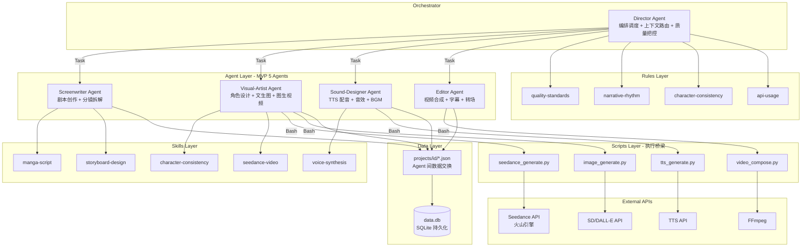
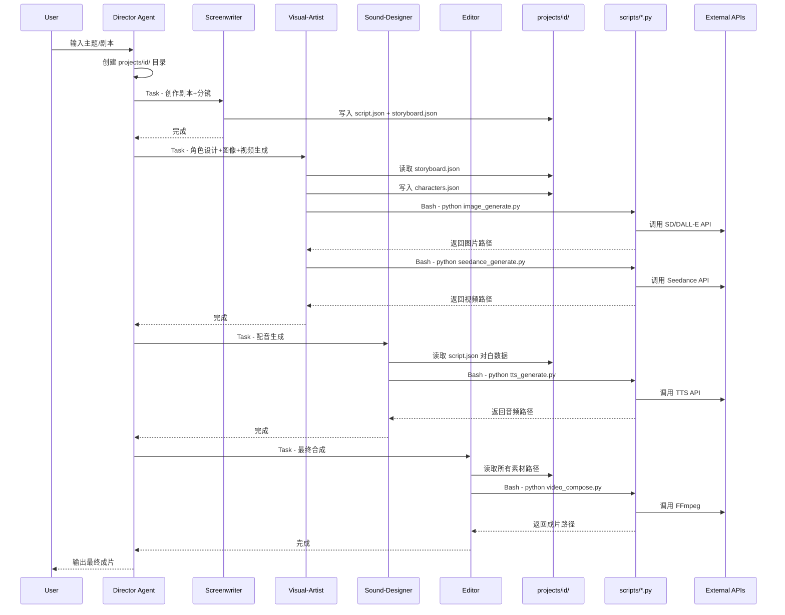

## 产品概述

构建基于 CodeBuddy 生态的 AI 漫剧生产流水线系统。采用子 Agent 驱动架构，配合 Skills 领域知识、Rules 质量约束、MCP 工具集成和 Memory 持久化，实现从剧本创作到视频成片的全链路自动化漫剧生产。

## 核心特性

- 子 Agent 体系：MVP 阶段精简为 5 个专业 Agent（导演、编剧、视觉师、音效师、剪辑师），模拟影视制作团队协同工作，通过项目工作目录 `projects/{id}/` 下的 JSON 文件进行 Agent 间数据交换
- Skills 领域知识：封装漫剧剧本写作、分镜设计、角色一致性、Seedance API 调用、语音合成等领域专业知识为可复用 Skill
- Scripts 执行层：提供实际的 Python 脚本调用火山引擎 Seedance API、TTS API、图像生成 API 和 FFmpeg 视频合成，作为 Agent 与外部 API 之间的桥梁
- MCP 工具配置：项目级 MCP 配置，通过 Python 脚本封装为 stdio MCP Server，供 Agent 调用
- Rules 质量约束：画面质量标准、叙事节奏约束、角色一致性检查、API 调用规范
- Memory 持久化：SQLite 数据库存储项目状态、剧本、分镜、角色、资产和生成历史，支持断点续跑

## 流水线阶段

1. 剧本输入/创作 + 分镜拆解（Screenwriter Agent）
2. 角色设计 + 文生图 + 图生视频（Visual-Artist Agent）
3. 配音与音效（Sound-Designer Agent）
4. 合成输出（Editor Agent）
5. 全程由 Director Agent 编排调度、上下文路由、质量把控

## 技术栈

- Agent 框架：CodeBuddy 子智能体（`.codebuddy/agents/*.md`），遵循现有 frontmatter 格式（name/description/tools/model）
- Skills 框架：项目级 CodeBuddy Skills（`.codebuddy/skills/*/SKILL.md`），遵循 YAML frontmatter + Markdown 指令格式
- Rules 框架：项目级 CodeBuddy Rules（`.codebuddy/rules/*.md`），遵循现有 `~/.codebuddy/rules/` 的 Markdown 格式
- MCP 协议：项目级 `.codebuddy/mcp.json`，通过 Python 脚本封装 stdio MCP Server
- 执行层：Python 3.10+ 脚本（`scripts/`），调用火山引擎 API、FFmpeg 等
- 数据持久化：SQLite（现有 `data.db`），6 张表覆盖完整数据模型
- 图生视频：Seedance 2.0（火山引擎 API）
- 图像生成：Stable Diffusion API / DALL-E API
- TTS：火山引擎语音合成 / Azure TTS

## 实现方案

### 核心设计决策

1. **MVP 精简 Agent 数量**：从原方案的 7+1 个精简为 5 个。编剧与分镜师合并为 Screenwriter（两者关联紧密），角色设计/文生图/图生视频合并为 Visual-Artist（均属视觉生成链），配音+音效合并为 Sound-Designer。后续可按需拆分。

2. **新增 Scripts 执行层**：CodeBuddy Agent 的 tools 仅支持 Read/Write/Edit/Bash/Grep/Glob/Task 等内置工具，无法直接调用外部 API。新增 `scripts/` 目录包含实际的 Python 脚本，Agent 通过 Bash 工具执行 `python scripts/seedance_generate.py` 等命令调用外部 API。这是连接 Agent 与外部世界的关键桥梁。

3. **Agent 间数据路由**：各 Agent 通过 `projects/{project-id}/` 目录下的标准 JSON 文件交换数据（script.json、storyboard.json、characters.json）。Director Agent 承担上下文路由职责，在调度子 Agent 时明确指定读写哪些文件。

4. **Skills 放项目级**：Skills 放在 `.codebuddy/skills/` 下，跟随项目版本管理，避免与用户全局 Skills 混淆。每个 Skill 遵循 skill-creator 规范的目录结构。

5. **MCP 渐进式实现**：第一版 MCP 配置预留接口但不强制要求 MCP Server 可用。Agent 主要通过 Bash 执行 Python 脚本。后续可将脚本封装为标准 MCP Server。

### 实现要点

- **Agent 定义格式**：严格遵循现有 `~/.codebuddy/agents/architect.md` 的格式：frontmatter（name/description/tools/model）+ Markdown 正文（角色说明/工作流程/输入输出规范）
- **Skill 定义格式**：严格遵循 `skill-creator` 的规范：frontmatter（name/description）+ Markdown 指令。使用祈使式/不定式写法，不用第二人称。可包含 scripts/references/assets 子目录
- **Rules 格式**：遵循现有 `~/.codebuddy/rules/` 的纯 Markdown 格式
- **MCP 配置格式**：遵循现有 `~/.codebuddy/mcp.json` 的 JSON 格式，key 为 server 名，value 含 command/args/env
- **数据库**：完整 6 张表 DDL（projects/scripts/storyboards/characters/assets/generations），TEXT 类型存储 JSON 字段
- **Python 脚本**：每个脚本独立可执行，接受命令行参数（JSON 字符串或文件路径），输出到指定路径，统一错误处理和日志格式

### 注意事项

- Agent tools 字段必须使用 CodeBuddy 支持的内置工具名称（Read/Write/Edit/Bash/Grep/Glob/Task 等）
- Director Agent 需要 Task 工具来调度其他子 Agent
- Python 脚本需要统一的环境变量配置（API Key 等），通过 `.env` 文件管理，`.gitignore` 排除
- 不主动创建独立的文档文件（遵循规则约束）

## 技术架构

### 系统架构



### 数据流



## 目录结构

```
my-ai-video-agent/
├── .codebuddy/
│   ├── agents/                              # [NEW] 子 Agent 定义（MVP 5 个）
│   │   ├── director.md                      # [NEW] 导演 Agent - 编排调度、上下文路由（通过读写 projects/id/ 下 JSON）、质量把控、调用子 Agent（Task 工具）
│   │   ├── screenwriter.md                  # [NEW] 编剧 Agent - 剧本创作+分镜拆解。读取用户输入，输出 script.json 和 storyboard.json
│   │   ├── visual-artist.md                 # [NEW] 视觉师 Agent - 角色设计+文生图+图生视频。通过 Bash 调用 scripts/ 下的 Python 脚本执行实际 API 调用
│   │   ├── sound-designer.md                # [NEW] 音效师 Agent - TTS 配音+音效。通过 Bash 调用 tts_generate.py
│   │   └── editor.md                        # [NEW] 剪辑师 Agent - 视频合成+字幕+转场。通过 Bash 调用 video_compose.py
│   │
│   ├── rules/                               # [NEW] 项目级规则
│   │   ├── quality-standards.md             # [NEW] 画面质量标准 - 分辨率要求、一致性检查清单、清晰度阈值
│   │   ├── narrative-rhythm.md              # [NEW] 叙事节奏约束 - 每镜头时长范围、转场类型、情绪曲线设计规则
│   │   ├── character-consistency.md         # [NEW] 角色一致性检查 - 外观/服装/表情一致性规则、Prompt 复用策略
│   │   └── api-usage.md                     # [NEW] API 调用规范 - 成本控制策略、重试机制、错误处理、环境变量管理
│   │
│   ├── skills/                              # [NEW] 项目级 Skills
│   │   ├── manga-script/                    # [NEW] 漫剧剧本写作 Skill
│   │   │   └── SKILL.md                     # 三幕式结构、场景描写、对白设计、情绪节奏。包含 Prompt 模板和剧本 JSON 输出规范
│   │   ├── storyboard-design/               # [NEW] 分镜设计 Skill
│   │   │   └── SKILL.md                     # 镜头语言（推/拉/摇/移）、构图法则、运镜参数、文生图 Prompt 模板
│   │   ├── character-consistency/           # [NEW] 角色一致性 Skill
│   │   │   └── SKILL.md                     # IP-Adapter/LoRA/Reference 技术选型、角色描述词模板、风格锁定策略
│   │   ├── seedance-video/                  # [NEW] Seedance 视频生成 Skill
│   │   │   ├── SKILL.md                     # 火山引擎 Seedance API 调用规范、Prompt 优化技巧、参数配置指南
│   │   │   └── references/                  # API 文档参考
│   │   │       └── seedance-api.md          # Seedance API 接口文档摘要
│   │   └── voice-synthesis/                 # [NEW] 语音合成 Skill
│   │       └── SKILL.md                     # TTS 引擎选型、情感语音控制、语速调节、多角色配音策略
│   │
│   └── mcp.json                             # [NEW] 项目级 MCP 配置 - 预留 Seedance/TTS/SD MCP Server 接口
│
├── scripts/                                 # [NEW] 执行层 - Agent 与外部 API 的桥梁
│   ├── seedance_generate.py                 # [NEW] Seedance 视频生成脚本 - 接受 JSON 参数，调用火山引擎 API，输出视频文件路径
│   ├── tts_generate.py                      # [NEW] TTS 语音合成脚本 - 接受文本+角色+情感参数，调用 TTS API，输出音频文件
│   ├── image_generate.py                    # [NEW] 图像生成脚本 - 接受 Prompt+参数，调用 SD/DALL-E API，输出图片文件
│   ├── video_compose.py                     # [NEW] FFmpeg 视频合成脚本 - 接受素材列表，执行合成/转场/字幕叠加
│   ├── db_manager.py                        # [NEW] SQLite 数据库管理 - 建表、CRUD 操作、数据导入导出
│   └── requirements.txt                     # [NEW] Python 依赖清单（requests, volcengine-sdk, ffmpeg-python 等）
│
├── schemas/                                 # [NEW] 数据模型定义（含示例模板）
│   ├── project.schema.json                  # [NEW] 项目数据结构 + 示例。字段：id/name/style/status/config
│   ├── script.schema.json                   # [NEW] 剧本数据结构 + 示例。字段：scenes[{id/description/dialogue/emotion/duration}]
│   ├── storyboard.schema.json               # [NEW] 分镜数据结构 + 示例。字段：shots[{id/scene_id/camera/prompt/duration}]
│   └── character.schema.json                # [NEW] 角色数据结构 + 示例。字段：id/name/appearance/style_keywords/reference_images
│
├── assets/                                  # [NEW] 全局资产目录
│   ├── characters/                          # 角色参考图/LoRA 模型
│   ├── scenes/                              # 场景背景素材
│   ├── audio/                               # BGM/音效素材
│   └── outputs/                             # 最终输出
│
├── projects/                                # [NEW] 漫剧项目工作目录（Agent 间数据交换中心）
│   └── example/                             # 示例项目结构
│       ├── script.json                      # 剧本数据（Screenwriter 输出）
│       ├── storyboard.json                  # 分镜数据（Screenwriter 输出）
│       ├── characters.json                  # 角色数据（Visual-Artist 输出）
│       ├── images/                          # 生成的分镜图片
│       ├── videos/                          # 生成的视频片段
│       └── audio/                           # 生成的音频文件
│
├── .env.example                             # [NEW] 环境变量模板（API Key 占位符）
├── .gitignore                               # [NEW] Git 忽略规则（.env, data.db, assets/outputs/, projects/*/images/ 等）
└── data.db                                  # [MODIFY] SQLite 数据库 - 初始化 6 张表
```

## 关键代码结构

### Agent frontmatter 格式（严格对齐现有约定）

```
---
name: director
description: AI 漫剧制作导演，负责编排调度各子 Agent、上下文路由（通过项目目录 JSON 文件）、质量把控。自动协调 screenwriter、visual-artist、sound-designer、editor 完成漫剧制作全流程。
tools: Read, Write, Bash, Grep, Glob, Task
model: opus
---
```

### Skill frontmatter 格式（严格对齐 skill-creator 规范）

```
---
name: seedance-video
description: Seedance 视频生成技术指南。当需要将静态图片转为动态视频、调用火山引擎 Seedance API、优化视频生成 Prompt 时，应使用此 Skill。
---
```

### 数据库完整 DDL

```sql
CREATE TABLE IF NOT EXISTS projects (
    id TEXT PRIMARY KEY,
    name TEXT NOT NULL,
    description TEXT,
    style TEXT DEFAULT 'manga',
    status TEXT DEFAULT 'draft',
    config TEXT,
    created_at DATETIME DEFAULT CURRENT_TIMESTAMP,
    updated_at DATETIME DEFAULT CURRENT_TIMESTAMP
);

CREATE TABLE IF NOT EXISTS scripts (
    id TEXT PRIMARY KEY,
    project_id TEXT NOT NULL REFERENCES projects(id),
    title TEXT,
    synopsis TEXT,
    scenes TEXT NOT NULL,
    metadata TEXT,
    created_at DATETIME DEFAULT CURRENT_TIMESTAMP
);

CREATE TABLE IF NOT EXISTS storyboards (
    id TEXT PRIMARY KEY,
    project_id TEXT NOT NULL REFERENCES projects(id),
    script_id TEXT REFERENCES scripts(id),
    shots TEXT NOT NULL,
    metadata TEXT,
    created_at DATETIME DEFAULT CURRENT_TIMESTAMP
);

CREATE TABLE IF NOT EXISTS characters (
    id TEXT PRIMARY KEY,
    project_id TEXT NOT NULL REFERENCES projects(id),
    name TEXT NOT NULL,
    description TEXT,
    appearance TEXT,
    reference_images TEXT,
    style_keywords TEXT,
    created_at DATETIME DEFAULT CURRENT_TIMESTAMP
);

CREATE TABLE IF NOT EXISTS assets (
    id TEXT PRIMARY KEY,
    project_id TEXT NOT NULL REFERENCES projects(id),
    type TEXT NOT NULL CHECK(type IN ('image','video','audio','reference','lora')),
    name TEXT NOT NULL,
    file_path TEXT NOT NULL,
    metadata TEXT,
    created_at DATETIME DEFAULT CURRENT_TIMESTAMP
);

CREATE TABLE IF NOT EXISTS generations (
    id TEXT PRIMARY KEY,
    project_id TEXT NOT NULL REFERENCES projects(id),
    stage TEXT NOT NULL CHECK(stage IN ('script','storyboard','image','video','audio','compose')),
    input_params TEXT,
    output_path TEXT,
    status TEXT DEFAULT 'pending' CHECK(status IN ('pending','running','success','failed')),
    error TEXT,
    cost REAL DEFAULT 0,
    duration_ms INTEGER,
    created_at DATETIME DEFAULT CURRENT_TIMESTAMP
);
```

## Agent Extensions

### Skill

- **skill-creator**
- 用途：创建 5 个项目级 Skills（manga-script、storyboard-design、character-consistency、seedance-video、voice-synthesis），遵循 skill-creator 的完整创建流程（理解 Skill -> 规划内容 -> 初始化 -> 编写 -> 迭代）
- 预期结果：在 `.codebuddy/skills/` 下生成 5 个符合 CodeBuddy 规范的 Skill 目录，每个包含高质量的 SKILL.md 文件，封装漫剧制作各阶段的领域知识、Prompt 模板和工作流程指导