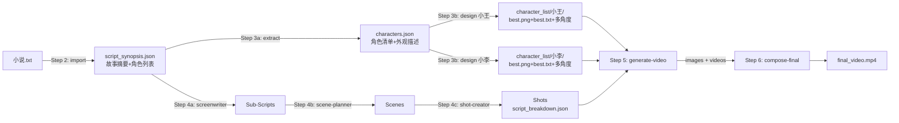

## 产品概述

基于 MovieAgent 核心架构（分层 CoT 拆解），重构当前 AI 漫剧流水线为 CodeBuddy Agent + 子 Agent + Skills + Rules + 记忆 的完整架构。输入从"交互式主题输入"改为"导入完整小说/剧本文本"，系统自动完成从剧本到视频的全链路生成。

## 核心特性

### 1. 新流水线（6 步，MovieAgent 式分层拆解）

- **Step 1 `/init-project`**：创建项目
- **Step 2 `/import-script`**：导入完整小说/剧本 .txt 文件，自动提取故事摘要 + 角色列表，生成 `script_synopsis.json`
- **Step 3a `/extract-characters`**：从剧本自动提取所有角色信息（名称、描述、关系、外观特征），写入 `characters.json` 角色清单，**不生成图片**
- **Step 3b `/design-characters {角色名}`**：按需逐个角色精细设计，生成 MovieAgent 格式的 `character_list/{角色名}/` 资产目录（best.png + best.txt + 多角度参考图 + audio.wav）。支持多种调用方式：
- `/design-characters` — 无参数，列出所有角色及其设计状态（已设计/未设计）
- `/design-characters 小王` — 设计指定角色
- `/design-characters all` — 批量设计所有未设计的角色
- **Step 4 `/break-script`**：MovieAgent 核心——剧本分层 CoT 拆解（Sub-Scripts → Scenes → Shots），每层独立 Agent + CoT Prompt 驱动，输出三层嵌套 JSON `script_breakdown.json`。**仅使用已设计的角色**（有 character_list 资产的角色）
- **Step 5 `/generate-video`**：基于 Shot 级分镜 + 角色资产库，逐镜头生成关键帧图片 + Seedance 2.0 视频
- **Step 6 `/compose-final`**：视频拼接、字幕烧录、BGM 混合，输出成片

### 2. MovieAgent 核心机制移植

- **分层 CoT 推理**：每层（编剧/场景规划/镜头创建）都要求 LLM 先输出 Internal Chain-of-Thought
- **角色资产库**：参照 MovieAgent 的 `character_list/{Name}/best.png + best.txt` 结构
- **双版本描述**：每个 Shot 同时生成 `Coarse Plot`（无人名，给图像生成）和 `Visual Description`（详细，给视频生成）
- **督导审查**：新增 Script Supervisor Agent 对编剧输出做质量审查
- **文件名即序列**：`Sub-Script_1|Scene_1|Shot_1.mp4` 排序规则

### 3. 新增 Skill：script-breakdown

- 封装 MovieAgent 三步分层拆解的完整 CoT Prompt 模板和方法论
- 包含 screenwriter-CoT、scene-planning-CoT、shot-create-CoT 三组 Prompt

### 4. 角色资产库增强

- 每个角色目录包含 best.png（最佳参考图）、best.txt（`<TOK>` 外观描述）、photo_N.png/txt（多角度）、audio.wav（声音参考）
- 角色外观描述采用 `<TOK>` 占位符格式，兼容多种图像生成引擎

## 技术栈

- **Agent 框架**：CodeBuddy Agent 架构（.codebuddy/agents/ + commands/ + skills/ + rules/）
- **执行层**：Python 脚本（scripts/*.py），通过 Bash 调用
- **数据存储**：SQLite（data.db）+ JSON 文件（projects/{project_id}/）
- **图像生成**：DALL-E 3 / Stable Diffusion API
- **视频生成**：Seedance 2.0（火山方舟 API）
- **音频**：Seedance 原生音轨 + 火山 TTS（Override）
- **合成**：FFmpeg

## 实现方案

### 核心策略：将 MovieAgent 的 4 文件 Python 架构映射到 CodeBuddy Agent 声明式架构

MovieAgent 的灵魂是 `system_prompts.py`（568 行 Prompt 模板）+ `run.py`（351 行调度逻辑），在我们的架构中：

- `system_prompts.py` → **Skills**（CoT Prompt 模板封装为 SKILL.md 知识文档）
- `run.py` ScriptBreakAgent → **Director Agent**（主调度）+ **子 Agents**（各步骤执行者）
- `base_agent.py` BaseAgent → CodeBuddy 的 Task 工具调度子 Agent（天然对应 `use_history=False`）
- `tools.py` ToolCalling → **scripts/*.py** Python 脚本层

### 关键技术决策

**1. 分层拆解采用"串行子 Agent 调用"而非"单 Agent 多步"**

MovieAgent 中 3 个 LLM Agent 都是 `use_history=False` 的独立调用。CodeBuddy 的 Task 工具天然匹配这一模式——Director 通过 Task 调用 screenwriter-agent（拆 Sub-Scripts）→ scene-planner-agent（拆 Scenes）→ shot-creator-agent（拆 Shots），每次调用独立上下文，避免长上下文污染。

**2. CoT 强制推理封装在 Skill 而非 Agent**

MovieAgent 的 CoT 逻辑在 system_prompt 中。我们将完整 CoT Prompt 模板封装到 `script-breakdown` Skill 的 SKILL.md 中，Agent 定义文件只描述角色和工作流，引用 Skill 获取 Prompt 模板。这样 Prompt 模板可以独立迭代优化。

**3. 三层嵌套 JSON 替代现有扁平结构**

现有的 `script.json`（扁平场景列表）+ `storyboard.json`（扁平镜头列表）替换为 MovieAgent 式的单个 `script_breakdown.json`——三层嵌套（Sub-Script → Scene → Shot），数据流更清晰，每层的 CoT 推理过程内联保存。

**4. 角色设计拆分为"提取"和"按需设计"两步**

MovieAgent 假设角色素材库预先存在。我们将角色处理拆为两步：

- **Step 3a `/extract-characters`**：纯文本分析，从剧本自动提取所有角色信息（名称、关系、外观描述），写入 `characters.json`。不消耗图像 API。
- **Step 3b `/design-characters {角色名}`**：用户按需逐个设计角色，每次只处理一个角色，生成 `character_list/{角色名}/` 完整资产目录。好处：
- 用户可以逐个审核/调整角色外观，不满意可以重新生成
- 未出场或次要角色可以先不设计，节省 API 成本
- 每个角色可以独立迭代（修改外观描述后重新生成参考图）
- `/design-characters all` 仍支持一次性批量设计

Step 4 的分镜拆解会检查角色是否已有 character_list 资产，有则在 Shot 中引用，无则仅用文字描述。

**5. 双版本描述适配 API 生态**

MovieAgent 的 `Coarse Plot`（给 ROICtrl，无人名）和 `Plot/Visual Description`（给其他模型）。我们适配为：

- `image_prompt`：英文，无角色名，纯场景描述 → 给 DALL-E 3 文生图
- `video_prompt`：中文，含 @引用 + 角色参考 → 给 Seedance 2.0
- `audio_prompt`：中文，音效描述 → 给 Seedance 2.0 音视频联合

## 实现备注

### 性能与成本

- 分层拆解共需 1 + N + M 次 LLM 调用（1 次编剧 + N 个 Sub-Script 的场景规划 + M 个 Scene 的镜头创建），对于一部 10 分钟短片约 20-40 次 LLM 调用
- 角色参考图生成：按需设计，每角色 3-5 张 DALL-E 调用（best + 多角度），用户可选择只设计关键角色
- 视频生成：每镜头 1 次 Seedance 调用，30 镜头约 30 次

### 向后兼容

- 保留 `scripts/*.py` 执行层不变（db_manager.py / image_generate.py / seedance_generate.py / tts_generate.py / video_compose.py）
- 新增 `scripts/import_script.py` 用于剧本导入和摘要提取
- 旧的 `script.json` / `storyboard.json` 不再使用，但保留 Schema 文件兼容已有项目
- DB 表结构保持不变，通过 JSON 字段灵活存储新数据结构

### 爆炸半径控制

- 不修改任何 scripts/*.py 执行脚本（仅新增 import_script.py）
- 不修改 init_db.sql 和数据库结构
- 原有 Agent / Command / Skill / Rule 全部重写（流水线变化较大，修补不如重写清晰）
- 新增的文件全部带 `[NEW]` 标记，方便回滚

## 架构设计

### 系统架构

```mermaid
graph TD
    User[用户] -->|/init-project| Director[Director Agent]
    User -->|/import-script + 小说.txt| Director
    User -->|/extract-characters| Director
    User -->|"/design-characters {角色名}"| Director
    User -->|/break-script| Director
    User -->|/generate-video| Director
    User -->|/compose-final| Director

    Director -->|Task| Screenwriter[Screenwriter Agent<br/>剧本拆解 - Sub-Scripts]
    Director -->|Task| ScenePlanner[Scene Planner Agent<br/>场景规划 - Scenes]
    Director -->|Task| ShotCreator[Shot Creator Agent<br/>镜头创建 - Shots]
    Director -->|Task| CharDesigner[Character Designer Agent<br/>单角色精细设计]
    Director -->|Task| VisualArtist[Visual Artist Agent<br/>图像/视频生成]
    Director -->|Task| Editor[Editor Agent<br/>视频合成]
    Director -->|Task| Supervisor[Script Supervisor Agent<br/>质量督导]

    Screenwriter -.->|读取| SkillBreakdown[Skill: script-breakdown<br/>CoT Prompt 模板]
    ScenePlanner -.->|读取| SkillBreakdown
    ShotCreator -.->|读取| SkillBreakdown
    CharDesigner -.->|读取| SkillChar[Skill: character-consistency]
    VisualArtist -.->|读取| SkillSeedance[Skill: seedance-video]

    Screenwriter -->|写入| JSON1[script_synopsis.json<br/>+ script_breakdown.json Step1]
    ScenePlanner -->|写入| JSON2[script_breakdown.json Step2]
    ShotCreator -->|写入| JSON3[script_breakdown.json Step3]
    CharDesigner -->|写入| CharBank[character_list/{角色名}/<br/>best.png+best.txt+多角度]
    VisualArtist -->|调用| Scripts[scripts/*.py<br/>image_generate / seedance_generate]
    Editor -->|调用| Compose[scripts/video_compose.py]
```

### 新流水线数据流



### Agent 分工对比

| 原 Agent | 新 Agent | 变化 |
| --- | --- | --- |
| director | director | 重写：7 步流水线（含 extract + design 拆分），新命令调度 |
| screenwriter | screenwriter | 重写：仅负责 Step 4a（Sub-Script 拆解），使用 CoT |
| - | scene-planner | **新增**：Step 4b，场景规划 CoT |
| - | shot-creator | **新增**：Step 4c，镜头创建 CoT |
| visual-artist | character-designer | 重写：负责 Step 3b 单角色精细设计（按需逐个生成 character_list 资产） |
| visual-artist | visual-artist | 重写：仅负责 Step 5 图像/视频生成 |
| editor | editor | 微调：适配新数据结构 |
| sound-designer | sound-designer | 保留不变 |
| - | script-supervisor | **新增**：督导 Agent，审查各步骤输出质量 |


## 目录结构

```
d:\codespace\my-ai-video-agent\
├── .codebuddy/
│   ├── agents/
│   │   ├── director.md              # [MODIFY] 重写：7步流水线编排（含extract+design拆分），调度7个子Agent，新增 /import-script、/extract-characters、/break-script、/compose-final 命令路由
│   │   ├── screenwriter.md          # [MODIFY] 重写：仅负责Step4a剧本→Sub-Scripts拆解，使用screenwriterCoT Prompt模板，输出Sub-Script层到script_breakdown.json
│   │   ├── scene-planner.md         # [NEW] 场景规划Agent：负责Step4b，逐个Sub-Script拆解为Scenes，使用ScenePlanningCoT Prompt模板，附加Scene Annotation到script_breakdown.json
│   │   ├── shot-creator.md          # [NEW] 镜头创建Agent：负责Step4c，逐个Scene拆解为Shots（含边界框、双版本描述、字幕），使用ShotPlotCreateCoT Prompt模板
│   │   ├── character-designer.md    # [NEW] 角色设计Agent：负责Step3b，接收单个角色名，生成该角色的character_list/{角色名}/资产目录（best.png+best.txt+多角度+audio.wav），支持重新生成
│   │   ├── visual-artist.md         # [MODIFY] 重写：仅负责Step5视频生成，读取script_breakdown.json的Shot层+character_list/资产库，逐镜头生成图片和Seedance视频
│   │   ├── editor.md                # [MODIFY] 微调：适配script_breakdown.json新数据结构，读取三层嵌套JSON提取有序Shot列表
│   │   ├── sound-designer.md        # [KEEP] 保持不变，TTS Override逻辑不变
│   │   └── script-supervisor.md     # [NEW] 督导Agent：审查screenwriter/scene-planner/shot-creator输出的质量，检查CoT推理完整性、角色一致性、时间线连贯性
│   ├── commands/
│   │   ├── init-project.md          # [MODIFY] 微调：更新目录结构（新增character_list/、final/），更新下一步提示为/import-script
│   │   ├── import-script.md         # [NEW] Step2命令：接收用户剧本.txt文件路径，调用import_script.py提取摘要+角色列表，生成script_synopsis.json，展示结果等待用户确认
│   │   ├── extract-characters.md   # [NEW] Step3a命令：Director直接执行，从script_synopsis.json+raw_script.txt提取所有角色信息，写入characters.json（名称/描述/关系/外观特征），不生成图片
│   │   ├── design-characters.md     # [MODIFY] 重写为Step3b：支持参数化调用（/design-characters {角色名}），调度character-designer子Agent为单个角色生成完整资产目录；无参数时列出角色状态；支持 all 批量设计
│   │   ├── break-script.md          # [NEW] Step4命令：三步串行调度（screenwriter→scene-planner→shot-creator），每步完成后可选督导审查，最终输出script_breakdown.json
│   │   ├── generate-video.md        # [MODIFY] 重写：适配script_breakdown.json三层嵌套结构，遍历Sub-Script→Scene→Shot生成视频
│   │   └── compose-final.md         # [NEW] Step6命令：调度editor子Agent，从script_breakdown.json提取有序Shot列表+字幕，拼接最终成片
│   ├── skills/
│   │   ├── script-breakdown/
│   │   │   └── SKILL.md             # [NEW] 核心Skill：封装MovieAgent三步分层CoT拆解的完整Prompt模板（screenwriterCoT-sys、ScenePlanningCoT-sys、ShotPlotCreateCoT-sys），包含输入输出格式、CoT推理步骤、质量约束
│   │   ├── character-consistency/
│   │   │   └── SKILL.md             # [MODIFY] 增强：新增MovieAgent角色资产库格式（character_list/结构）、<TOK>占位符用法、多角度参考图生成策略、audio.wav声音参考
│   │   ├── manga-script/
│   │   │   └── SKILL.md             # [MODIFY] 适配：从"从主题创作剧本"改为"从完整小说提取摘要+角色"，新增小说解析策略
│   │   ├── storyboard-design/
│   │   │   └── SKILL.md             # [MODIFY] 适配：新增双版本描述（image_prompt vs video_prompt）、MovieAgent式Shot数据结构
│   │   ├── seedance-video/
│   │   │   └── SKILL.md             # [KEEP] 保持不变
│   │   └── voice-synthesis/
│   │       └── SKILL.md             # [KEEP] 保持不变
│   ├── rules/
│   │   ├── api-usage.md             # [KEEP] 保持不变
│   │   ├── character-consistency.md # [MODIFY] 增强：新增character_list/目录结构校验规则、best.png必须存在、<TOK>描述格式校验
│   │   ├── narrative-rhythm.md      # [KEEP] 保持不变
│   │   ├── quality-standards.md     # [MODIFY] 增强：新增CoT推理完整性检查、三层嵌套JSON结构校验
│   │   └── cot-reasoning.md         # [NEW] CoT推理规则：强制要求每层输出Internal Chain-of-Thought，定义CoT各步骤的必填字段，禁止跳过推理直接输出结果
│   ├── plans/                       # [KEEP]
│   └── mcp.json                     # [KEEP] 保持不变
├── scripts/
│   ├── import_script.py             # [NEW] 剧本导入脚本：读取.txt文件，调用LLM提取故事摘要+角色列表，输出script_synopsis.json格式的JSON
│   ├── db_manager.py                # [KEEP] 保持不变
│   ├── image_generate.py            # [KEEP] 保持不变
│   ├── seedance_generate.py         # [KEEP] 保持不变
│   ├── tts_generate.py              # [KEEP] 保持不变
│   ├── video_compose.py             # [KEEP] 保持不变
│   ├── init_db.sql                  # [KEEP] 保持不变
│   └── requirements.txt             # [KEEP] 保持不变
├── schemas/
│   ├── script_synopsis.schema.json  # [NEW] 剧本摘要Schema：{MovieScript: string, Character: string[], Relationships: {}}
│   ├── script_breakdown.schema.json # [NEW] 三层嵌套分镜Schema：Sub-Script → Scene Annotation → Shot Annotation，含CoT字段
│   ├── character_list.schema.json   # [NEW] 角色资产库Schema：定义character_list/目录结构、best.png+best.txt+photo_N+audio.wav
│   ├── character.schema.json        # [KEEP] 保留兼容旧项目
│   ├── project.schema.json          # [MODIFY] 新增状态枚举：imported、characters_extracted、characters_designing、script_broken
│   ├── script.schema.json           # [KEEP] 保留兼容旧项目
│   └── storyboard.schema.json       # [KEEP] 保留兼容旧项目
├── projects/                        # 项目工作目录
│   └── {project_id}/
│       ├── raw_script.txt           # Step 2: 用户导入的原始剧本
│       ├── script_synopsis.json     # Step 2: 提取的摘要+角色列表
│       ├── characters.json          # Step 3a: 角色清单（含外观描述+设计状态 extracted/designed）
│       ├── character_list/          # Step 3b: MovieAgent格式角色资产库（按需生成）
│       │   └── {CharName}/
│       │       ├── best.png
│       │       ├── best.txt
│       │       ├── photo_1.png
│       │       ├── photo_1.txt
│       │       └── audio.wav
│       ├── script_breakdown.json    # Step 4: 三层嵌套分镜（核心产物）
│       ├── images/shots/            # Step 5: 关键帧图片
│       ├── videos/                  # Step 5: 视频片段
│       ├── video_manifest.json      # Step 5: 视频清单
│       ├── audio/                   # 可选: TTS Override
│       └── final/                   # Step 6: 最终成片
├── agent.md                         # [MODIFY] 更新项目总览文档
├── guide.md                         # [MODIFY] 更新快速启动指南
└── MovieAgent核心实现分析.md         # [KEEP] 参考文档
```

## 关键数据结构

### script_synopsis.json（Step 2 产物，对应 MovieAgent 的 dataset/{movie}/script_synopsis.json）

```typescript
interface ScriptSynopsis {
  MovieScript: string;          // 故事摘要（150-500词，从小说提取）
  Character: string[];           // 角色名列表
  Relationships: Record<string, string>;  // 角色关系，如 {"Anna - Elsa": "Sisters"}
  raw_script_path: string;       // 原始剧本文件路径
  extracted_at: string;          // ISO timestamp
}
```

### script_breakdown.json（Step 4 产物，三层嵌套，对应 MovieAgent 的 Step_3_shot_results.json）

```typescript
interface ScriptBreakdown {
  project_id: string;
  Relationships: Record<string, string>;
  "Internal Chain-of-Thought": Record<string, string>;  // 编剧CoT
  "Sub-Script": Record<string, {
    Plot: string;                    // 详细剧情（>=50词）
    "Involving Characters": string[];
    Timeline: string;                // Beginning / Middle / End
    "Reason for Division": string;
    "Scene Annotation": {
      "Internal Chain-of-Thought": Record<string, string>;  // 场景规划CoT
      Scene: Record<string, {
        "Involving Characters": string[];
        Plot: string;
        "Scene Description": string;
        "Emotional Tone": string;
        "Visual Style": string;
        "Key Props": string[];
        "Music and Sound Effects": string;
        "Cinematography Notes": string;
        "Shot Annotation": {
          "Internal Chain-of-Thought": Record<string, string>;  // 镜头创建CoT
          Shot: Record<string, {
            "Involving Characters": Record<string, number[]>;  // {name: [x1,y1,x2,y2]}
            "Plot/Visual Description": string;    // 详细描述（>=30词）
            "Coarse Plot": string;                // 无人名简洁描述（<=20词）
            "image_prompt": string;               // 英文，给DALL-E
            "video_prompt": string;               // 含@引用，给Seedance
            "audio_prompt": string;               // 中文，给Seedance音视频联合
            "Emotional Enhancement": string;
            "Shot Type": string;
            "Camera Movement": string;
            "Duration": number;                   // 4/5/10/15
            "Subtitles": Record<string, string>;  // {角色名: 台词}
            "seedance_mode": string;              // i2v / multimodal
          }>;
        };
      }>;
    };
  }>;
}
```

## Agent Extensions

### Skill

- **skill-creator**
- 用途：创建新的 `script-breakdown` Skill，封装 MovieAgent 三步分层 CoT 拆解的完整 Prompt 模板
- 预期结果：生成 `.codebuddy/skills/script-breakdown/SKILL.md`，包含 screenwriterCoT、ScenePlanningCoT、ShotPlotCreateCoT 三组完整 Prompt 模板和使用指南

- **character-consistency**
- 用途：增强角色资产库设计，新增 MovieAgent 格式的 character_list 目录结构和 `<TOK>` 描述规范
- 预期结果：更新后的 Skill 涵盖 best.png/best.txt/photo_N/audio.wav 完整规范

- **manga-script**
- 用途：适配剧本导入场景，从"创作剧本"改为"解析小说提取摘要"
- 预期结果：Skill 包含小说解析、摘要提取、角色识别的方法论

- **storyboard-design**
- 用途：适配 MovieAgent 式 Shot 数据结构，新增双版本描述规范
- 预期结果：Skill 包含 image_prompt / video_prompt / audio_prompt 三种 Prompt 的生成规范